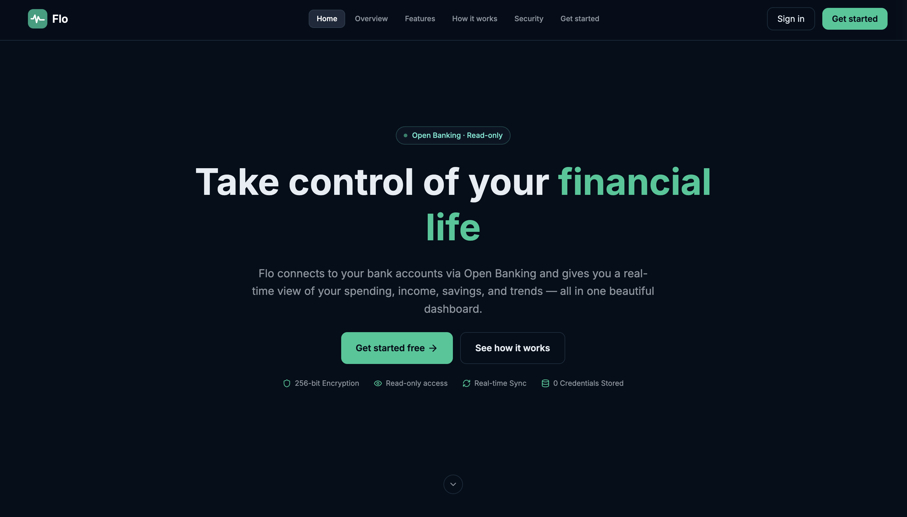
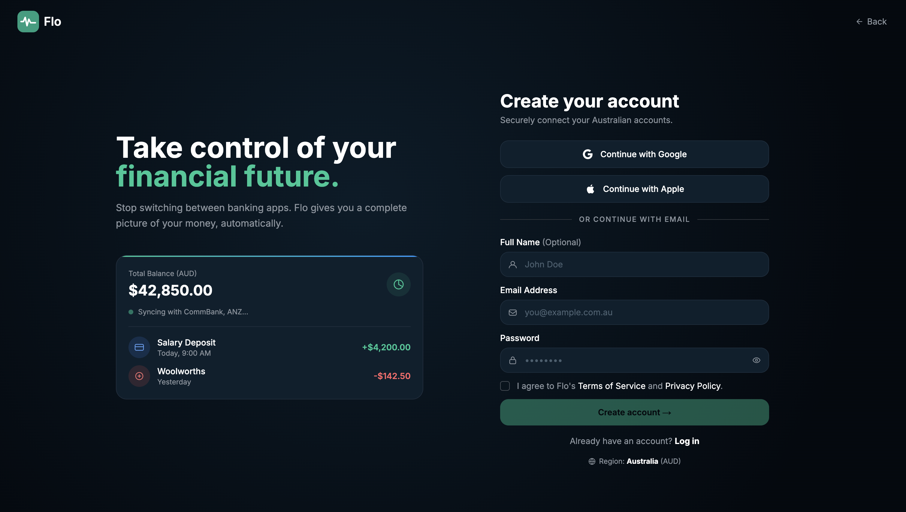
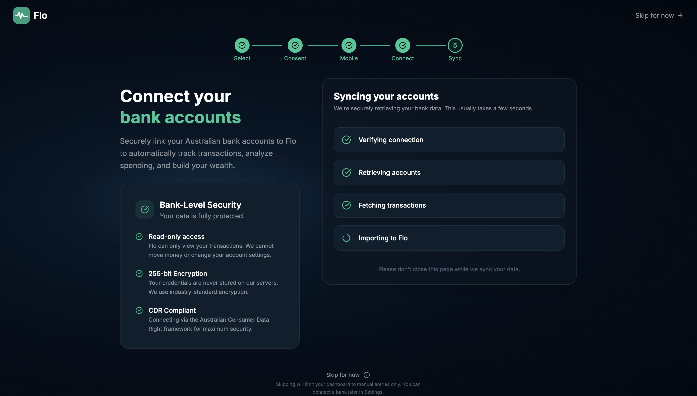
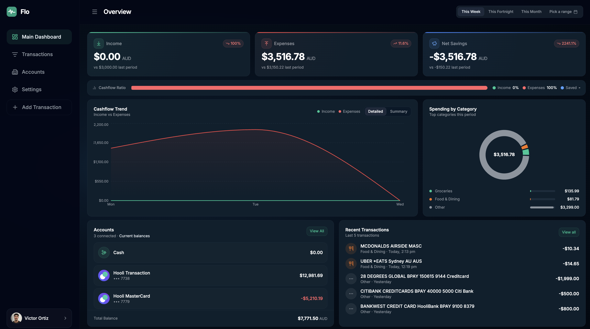
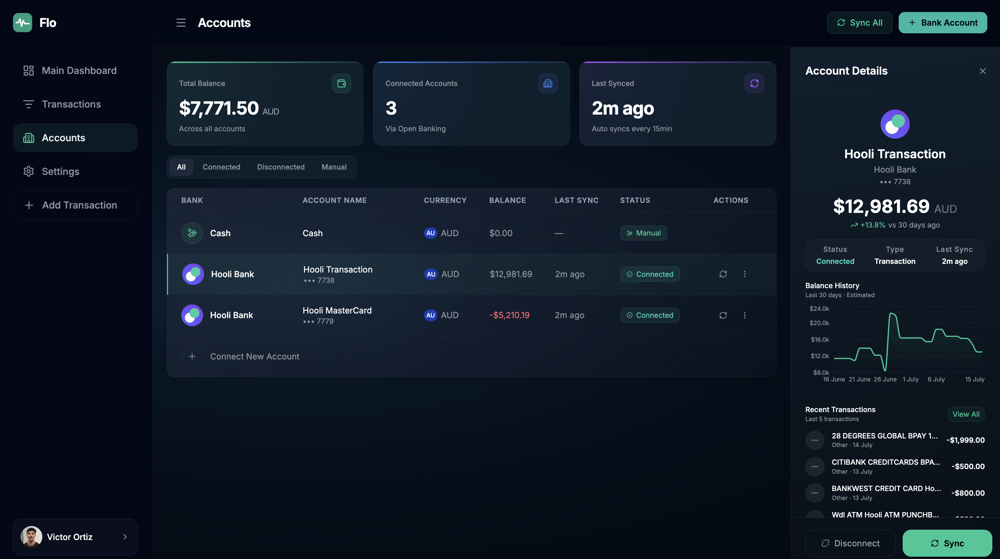
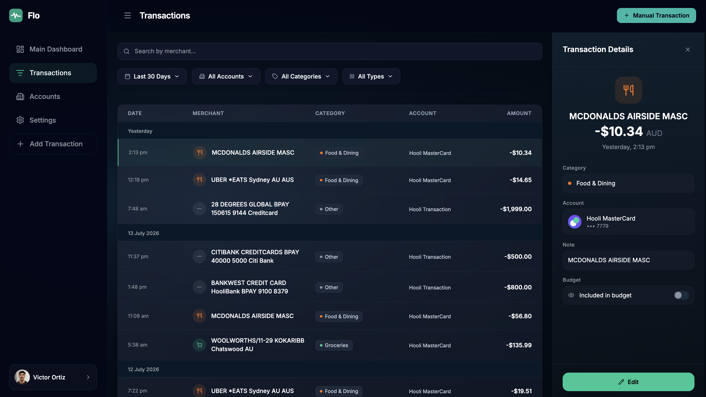
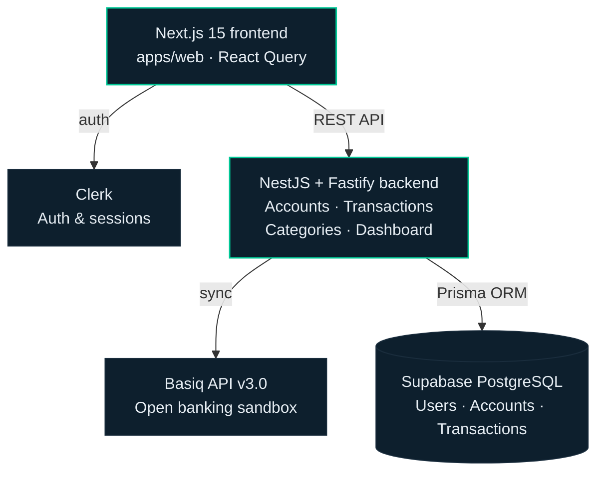

# Flo

A personal finance management (PFM) app for the Australian market — connect your bank accounts, track spending, and understand your cash flow in one place.

---

## About

Flo is a full-stack, solo-built personal finance tracker designed around real Australian Open Banking (Consumer Data Right) integration. It handles bank connection and transaction sync, a dashboard with spending insights, transaction management, custom categories, and manual (cash) account tracking — the same feature set and architecture you'd expect from a production PFM product.

The project was built end-to-end across 43 completed issues, from initial project scaffolding through to a fully working dashboard and transaction system.

---

## Screenshots

| | |
|---|---|
| **Landing page** | **Sign up** |
|  |  |
| **Bank connection onboarding** | **Dashboard overview** |
|  |  |
| **Accounts** | **Transactions** |
|  |  |

---

## Features

- **Authentication** — sign up, sign in, OAuth, email verification, password reset (Clerk)
- **Bank connection** — guided onboarding flow, Open Banking auth via Basiq, automatic transaction sync with pagination and idempotent upserts
- **Dashboard** — summary stat cards, cashflow trend chart (daily/weekly/monthly views with historical navigation), top spending categories, recent transactions, account overview
- **Transactions** — searchable, filterable transaction list with a detail panel for editing category, notes, and excluding items from budget calculations
- **Manual (cash) accounts** — track cash spending alongside connected bank accounts, with full add/edit/delete support
- **Categories** — system-defined categories plus fully custom user-defined categories with icon and color pickers
- **Accounts** — connect, disconnect, and inspect individual accounts, including a derived balance history for transaction and savings accounts
- **Settings** — profile management, category management

---

## Tech stack

| Layer | Technology |
|---|---|
| Frontend | Next.js 15 (`apps/web`) |
| Backend | NestJS + Fastify |
| Database | Supabase (PostgreSQL) + Prisma 7 |
| Auth | Clerk |
| Open Banking | Basiq API v3.0 (sandbox) |
| Local dev | Docker Compose |
| Data fetching | React Query |
| Animation | Framer Motion |
| Icons | Lucide React |

---

## Architecture

Flo is a monorepo with a decoupled frontend and backend, communicating over a REST API.



A few architectural points worth calling out:

- **Timezone-aware queries** — every request carries an `x-timezone` header so date range queries, chart grouping, and transaction filtering all resolve against the user's local time rather than server/UTC time.
- **Backend-grouped chart data** — cashflow chart summaries (weekly/fortnightly/monthly) are grouped on the backend rather than sent as raw daily records to the client, keeping payloads small.
- **Idempotent sync** — transaction sync from Basiq upserts on a unique Basiq ID, so repeated or overlapping syncs never create duplicates.
- **Derived balance history** — since Open Banking data doesn't include historical balance snapshots, balance history is derived by walking backwards from the current balance through stored transactions, and is only shown for account types (transaction/savings) where this stays accurate.

---

## Getting started

### Prerequisites

- Node.js
- Docker & Docker Compose
- A [Basiq](https://basiq.io) developer account (sandbox is free)
- A [Clerk](https://clerk.com) account
- A [Supabase](https://supabase.com) project

### Setup

```bash
git clone https://github.com/vortizz/flo.git
cd flo
docker compose up -d
```

Copy `.env.example` to `.env` in the relevant packages and fill in your Clerk, Supabase, and Basiq credentials.

Run database migrations:

```bash
npx prisma migrate dev
```

Start the dev servers as described in each package's own scripts.

> Bank connections will only work against Basiq's sandbox test institutions (e.g. `AU00000`) unless you have your own accredited Open Banking access.

---

## Project structure

High-level layout of the monorepo:

```
flo/
├── apps/
│   └── web/                    # Next.js 15 frontend
│       ├── app/
│       │   ├── (auth)/         # sign-in, sign-up, password reset, email verification
│       │   ├── (dashboard)/    # accounts, dashboard, settings, transactions
│       │   └── onboarding/     # bank connection flow
│       ├── components/         # accounts, categories, dashboard, landing, settings, transactions, ui
│       ├── lib/                # api client, query-client, utils
│       ├── hooks/
│       └── constants/
│
├── backend/                    # NestJS + Fastify
│   ├── prisma/                 # schema, migrations, seed
│   └── src/
│       ├── common/             # decorators, guards, interceptors, date helpers
│       ├── config/
│       └── modules/            # accounts, auth, basiq, categories, dashboard, institutions, transactions, users
│
└── docker-compose.yml
```

---

## Why no live bank data?

Australia's Consumer Data Right (CDR) requires either direct ACCC accreditation or acting as a "Representative" under an Accredited Data Recipient (ADR) Principal. Both routes are effectively closed to independent, pre-revenue developers — the Representative model in particular requires a commercial relationship that providers like Basiq and Frollo currently reserve for established institutions and larger corporate clients.

Flo is built to the same standard it would need for a live launch — real OAuth-style Open Banking auth flows, real transaction sync and pagination, real balance derivation — just pointed at a sandbox instead of production bank connections.

---

## License

Personal project — not currently licensed for reuse.